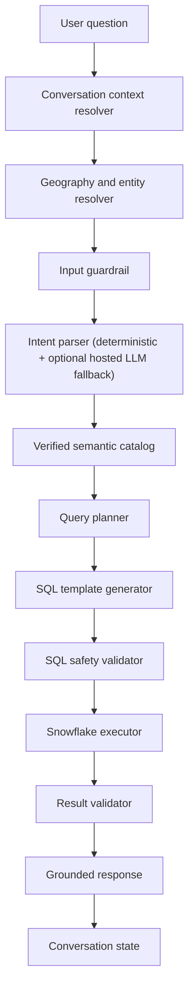

# Architecture

The application is a controlled analytics pipeline rather than free-form text-to-SQL.

The LLM is allowed to interpret language, but it is not allowed to invent schema, choose arbitrary Census variables, or execute SQL. The code owns the catalog, planning, SQL templates, validators, and result checks.

The strongest reliability boundary is the metric registry. For example, a user asking for "population" maps to `total_population`, which maps to `B01003e1`. A user asking about people age 65 and older maps to `population_65_plus`, which is a verified sum of multiple B01001 age columns. The model cannot substitute a nearby but semantically different column.

The planner uses intent-specific completeness rules:

- Lookup requires a specific geography.
- Ranking requires a metric and geography level, but not a named geography.
- Filtering requires a metric, geography level, and threshold condition.
- Breakdown requires a selected geography and supported dimension.
- Future forecast requests are refused unless verified forecast data exists.

Catalog layers:

- Verified metric registry for trusted common measures and formulas.
- Variable catalog for metadata search over Census concepts, labels, universes, and columns.
- Taxonomy for capability responses and broad topic classification.
- Geography alias catalog for city/county-set entities such as NYC.
